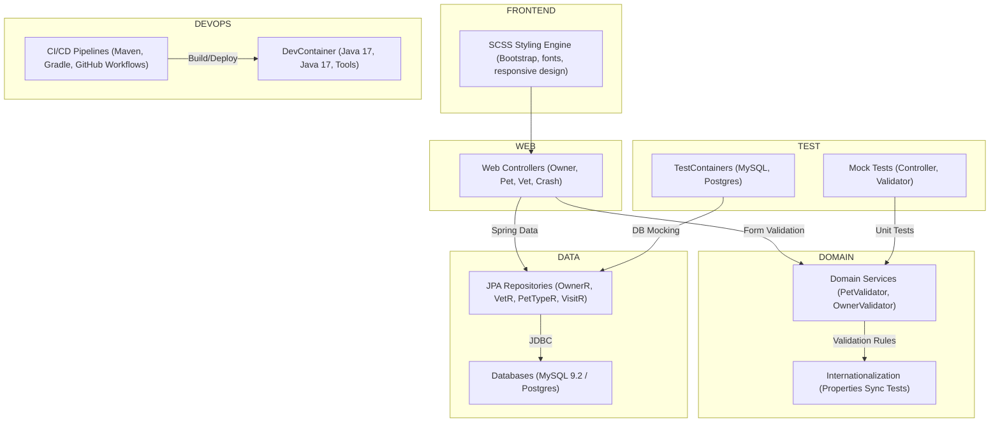

<think>
Okay, I need to analyze the codebase summary provided and generate a component-level architecture diagram. The user wants a Mermaid graph in graph TB syntax and a short rationale explaining the component boundaries and communications.

First, I'll look through the summaries. The main components mentioned are SCSS Styling Engine, Web Controllers, Domain Services, Data Access Layer, DevOps/Testing Infrastructure, and Test Infrastructure with TestContainers. These seem like key modules.

The SCSS Styling Engine handles frontend styling using SCSS, so that's a frontend component. Web Controllers handle REST endpoints and form processing for Owners, Pets, Vets, etc. Domain Services include validation and internationalization. The Data Access Layer is JPA repositories and databases like MySQL and PostgreSQL. The DevOps Infrastructure involves Docker, Kubernetes, and GitHub workflows. Test Infrastructure includes TestContainers and unit tests.

The communication between components needs to be mapped. For example, Web Controllers use Domain Services to process business logic, which in turn use the Data Access Layer to interact with the database. SCSS Styling Engine is used for UI rendering. TestContainers is part of the Test Infrastructure, and the DevOps setup uses Docker and Kubernetes for deployment.

Need to make sure components are grouped by their responsibilities and that interactions follow the flow of data, like controllers calling services, services using repositories, repositories hitting the database.

The rationale should explain why these components are separated and how they communicate, perhaps noting patterns like layered architecture, separation of concerns, and integration testing strategies.

Let me structure the Mermaid diagram accordingly, labeling each component with the key packages/classes and their interactions. Ensure the graph TB flows correctly from top (UI) to bottom (database), and left to right for test infrastructure.
</think>

**Rationale:**  
This decomposition reflects a layered architecture where SCSS handles UI rendering, Web Controllers manage HTTP interactions and form processing, Domain Services enforce business rules (e.g., validation), and JPA Repositories abstract data access. TestContainers provides isolated DB environments for integration testing. Component boundaries align with Spring’s MVC pattern and modular responsibilities, ensuring separation between presentation, business logic, and persistence layers while enabling scalable microservice decomposition.