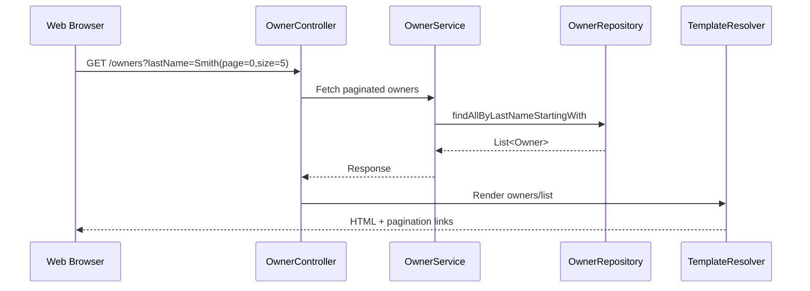
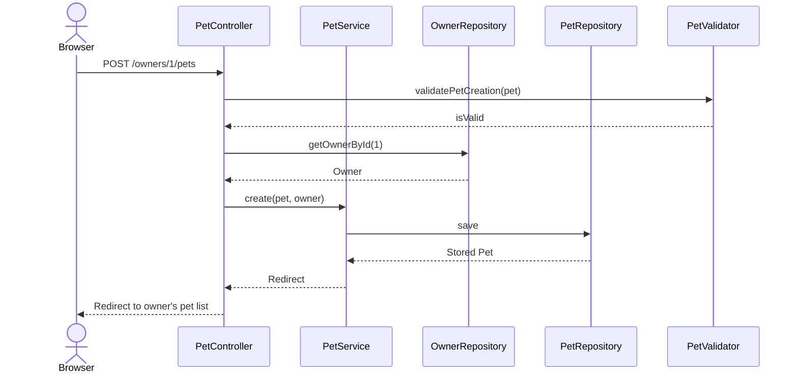
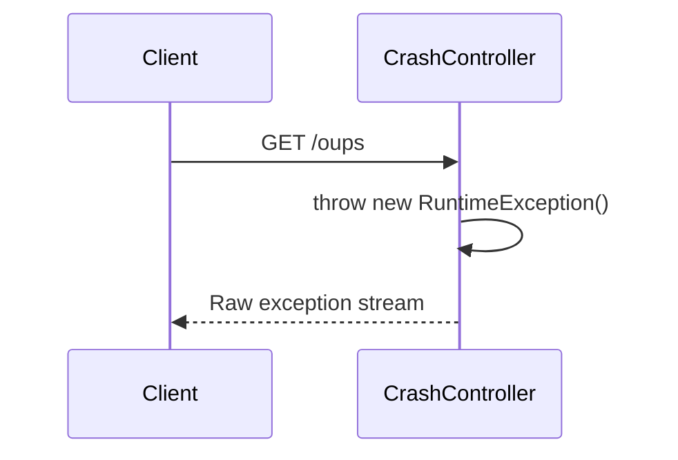
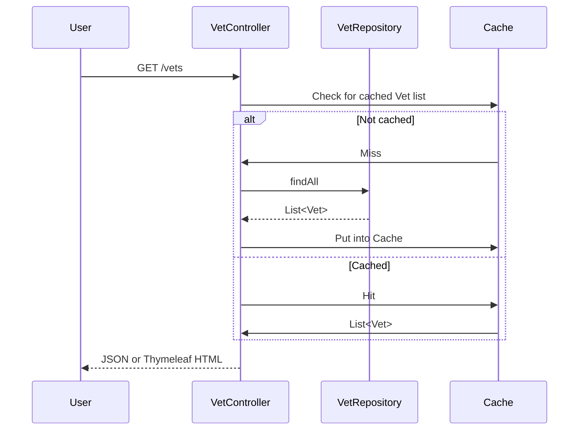
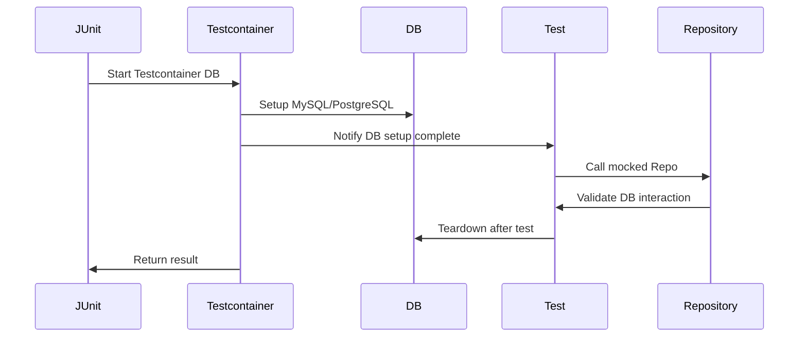
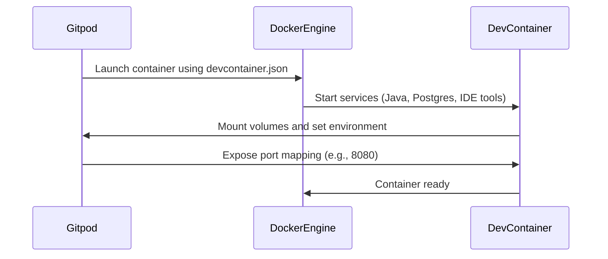
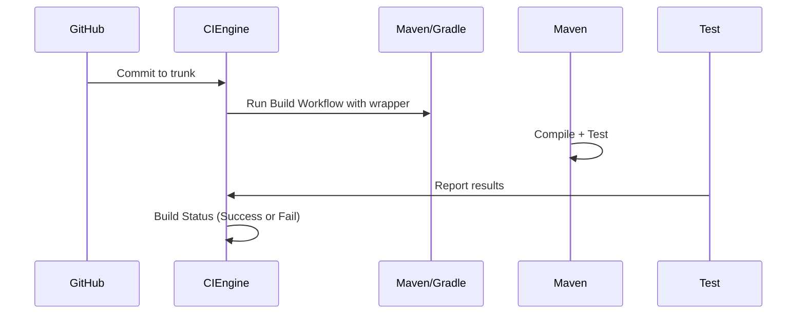

<think>
Alright, let me break down how I’ll analyze the provided architecture summary and deliver the requested dynamic interaction flows and sequence diagrams.

---

## Workflows & Key Interactions

### **1. Owner Search (User Clicks 'Find Owners')**
**Workflow Purpose**: Allow users to search for owners by name (pagination, filtering).  
**Triggers**: GET request `/owners`

**Communication Patterns**:  
- Synchronous HTTP call (GET) to backend.
- REST API: Spring MVC @RequestMapping.
- Pagination using Pageable.
- HTML Rendering via Thymeleaf.

Here's the **sequence diagram** for owner search:

---

### **2. Pet Creation**
**Workflow Purpose**: Enable users to create a new pet linked to an existing owner.  
**Triggers**: Post request to `/owners/{ownerId}/pets`

**Communication Patterns**:  
- Synchronous REST call.
- Repository transaction to persist both owner and pet.
- UI-based form handling.

---

### **3. Error Handling (Uncaught Exception in CrashController)**
**Workflow Purpose**: Demonstrate handling of uncaught exceptions in web layer.  
**Triggers**: GET request `/oups` (custom route)

**Pattern**: One-off test-based design to simulate and catch unexpected behavior.

---

### **4. Vet Data Retrieval & Caching**
**Workflow Purpose**: Provide REST API and HTML endpoint to list vets with caching for high access.  
**Trigger**: GET `/vets` / `/vets.html`

**Patterns**:
- Caching using `@Cacheable` with Caffeine.
- REST & UI dual-endpoint delivery.

---

### **5. Cross-Schema Testing with Testcontainers**
**Workflow Purpose**: Simulate real database environments during integration testing.  
**Trigger**: Integration tests (e.g., `PostgresDatabaseTest`)

**Patterns**: 
- Asynchronous setup via Testcontainers in CI/CD.
- JUnit5 lifecycle-driven testing.

---

### **6. DevContainer Configuration**
**Workflow Purpose**: Provide an isolated and reproducible development environment.  
**Trigger**: IDE plugin loads `devcontainer.json`

**Patterns**:
- Asynchronous DevContainer launch in Gitpod.
- Volume mounts and environment-specific setup.

---

### **7. CI/CD Pipeline with Maven/Gradle**
**Workflow Purpose**: Ensure build consistency using versioned wrappers.  
**Trigger**: Commit pushed to repo

**Patterns**:
- Synchronous CI/CD using GitHub Actions.
- Test-first pipeline design.

---

### Summary of Interactions
- **UI Layer**: Uses REST endpoints and Thymeleaf for HTML.
- **Data Access Layer**: JPA + H2/MySQL/PostgreSQL for persistence.
- **Testing Strategy**: 
  - Unit tests: MockMvc, JUnit.
  - Integration tests: Testcontainers.
- **Microservice Potential Breaking Points**:
  - Owners/Pets API.
  - Vet + Specialty Microservices.
  - Global Caching API (Caffeine + Redis potential).
  - Static content microservice (SCSS + Bootstrap).