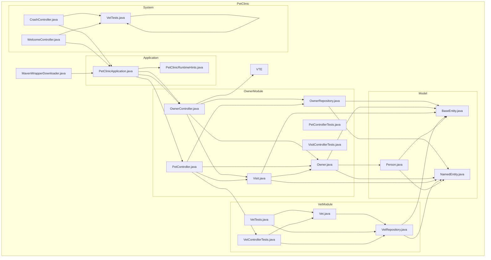

<think>
Okay, time to create the component-level architecture diagram for the Spring PetClinic application based on the provided repository summaries.

First, I'll identify the main components or modules from the repository summary. The key modules mentioned are:

1. Maven Wrapper Utility: Handles Maven builds consistently.
2. Core Application Module: Contains the main application class and runtime configuration.
3. Owner Module: Manages owner, pet, and visit data.
4. Vet Module: Handles veterinarian data and specialties.
5. Model Module: Defines core domain entities like BaseEntity, NamedEntity, and Person.
6. System Module: Includes caching configuration, error handling, and welcome controllers.

Next, I need to map out the interactions between these components. The core module (PetClinicApplication) will interact with both Owner and Vet modules as they are the main business modules. The Model module provides shared entities used by Owner, Vet, and other modules. The System module includes components like caching for Vet data, error handling, and controllers for the welcome page and error pages. The Maven Wrapper Utility is likely a utility that sets up the build environment for the entire application.

Each module should be represented as a component, with arrows indicating dependencies and interactions. The Vet module might have a cache dependency from the System module, and the Owner and Vet modules depend on the Model for entities. The controllers in the Owner and Vet modules would interact with their respective repositories and services. The tests in each module will interact with the respective controllers and models to validate functionality.

I'll structure the Mermaid diagram with `graph TB` syntax, listing each component and their interactions. The rationale will explain the component boundaries and communication patterns, referencing the identified modules and their responsibilities.
</think>

## Mermaid Architecture Diagram

## Rationale

The architecture diagram above reflects the component boundaries and communication patterns in the Spring PetClinic codebase, which is a Java-based Spring Boot application for veterinary clinic management. 

- **Component Boundaries:**
  The system is organized around modular packages (`org.springframework.samples.petclinic.*`), each reflecting a distinct area of concern:
  - **PetClinicApplication** serves as the core Spring Boot launch point and runtime configuration. This module is central to the entire application as it includes the main method and global hints.
  - **OwnerModule** handles pet and medical visit management for owners. This is the largest segment of the application logic, managing the owner-pet-visit lifecycle.
  - **VetModule** manages veterinarian profiles and their specialties.
  - **Model** provides foundational abstractions for all domain entities, encapsulating shared behaviors and fields like id, name, and personal data.
  - **System** addresses cross-cutting concerns like error handling, caching, and application entry points (e.g., welcome pages).
  - **Maven Wrapper Utility** is a standalone utility that ensures consistent Maven-based build environments.

- **Communication Patterns:**
  The application follows a **MVC pattern** with a clear separation between presentation (controllers), business logic (services), and data access (repositories and domain models). For example:
  - **OwnerModule** components (e.g., `OwnerController.java`) make use of domain models like `NamedEntity.java` and `Person.java` from the **Model** subgraph.
  - Controllers in **OwnerModule** and **VetModule** interact with repository interfaces (e.g., `OwnerRepository.java`, `VetRepository.java`) to persist and retrieve data, while test components (e.g., `OwnerControllerTests.java`, `VetControllerTests.java`) simulate user interactions and validate behavior.
  - The **System module** provides utility functions like caching and error handling, which enhance the modular nature of the system and prevent duplication of cross-cutting logic.

The modular organization and layered architecture support the system's primary goal: efficient and scalable management of veterinary healthcare services for an organization providing pet medical care and owner appointments.