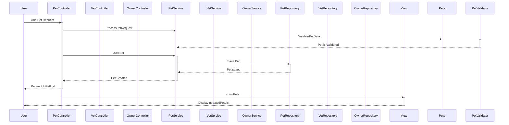
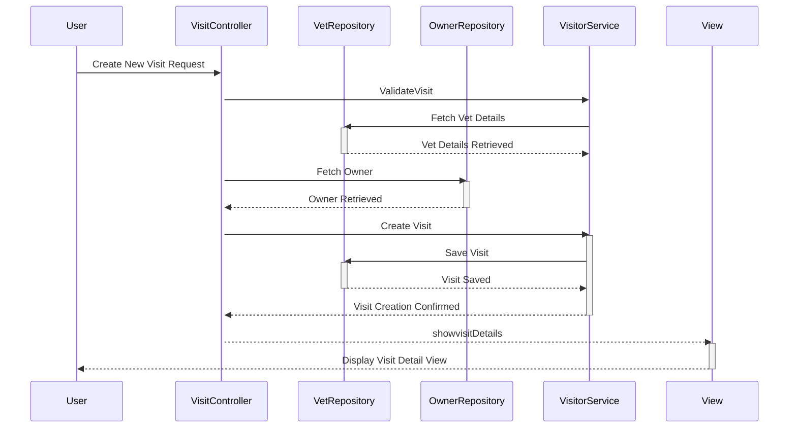
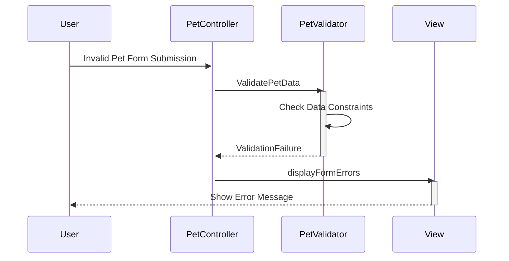

<think>
Okay, I need to analyze the PetClinic Spring Boot application and create a comprehensive dynamic interaction flow using Mermaid sequence diagrams. The user wants me to cover five aspects: user workflows, component communication, data flows, event-driven interactions, and error handling. Let's start by understanding each part of the system.

First, the key entities in PetClinic are Owner, Pet, Vet, and Visit. The main user workflows likely involve creating and managing pets for owners, scheduling visits with vets, and managing vet information. 

1. **Owner and Pet Management Workflow**:
   - A user (admin or owner) creates an owner, adds pets, and manages their information.
   - The OwnerController handles HTTP requests, validates using PetValidator, interacts with OwnerRepository, and persists data.

2. **Veterinarian and Visit Management**:
   - Vets are managed via VetController, which queries VetRepository.
   - Visits are added via VisitController, linking to pets and vets.

Component communication:
- The web layer (controllers) communicates with the service layer to handle business logic.
- Services interact with repositories for data access, using JPA or Hibernate.
- Validation occurs before data is persisted, using custom validators like PetValidator.

Data flows:
- Data flows from request (HTTP) through controllers to services and repositories.
- For example, when adding a pet, form data is validated, then sent to the OwnerRepository to save.

Event-driven interactions:
- There's no explicit mention of events in the summary, but typical Spring MVC applications are not heavily event-driven unless using something like Spring Cloud Stream or WebFlux. Maybe the error handling is the primary event-driven aspect via exceptions.

Error handling:
- When invalid data is encountered (e.g., owner without a first name), validation exceptions are thrown, and error messages are returned to the user.

Now, I need to create sequence diagrams for each major workflow. For example, creating an owner and their pets. The sequence would involve the user sending a POST request to the OwnerController, which validates the data and then calls the OwnerRepository to save the owner. If the validation fails, an error is returned immediately.

For the Vet and Visit workflow, the user might request to add a visit for a pet. The VisitController would require the pet ID, check the repository, validate the visit data, and then save it.

Each sequence diagram should show the interaction steps, including validation checks and repository calls. Also, handle error scenarios, such as duplicate pet names for an owner, leading to an error message.

I need to ensure the Mermaid diagrams clearly show the components (controllers, services, repositories) and the flow of messages. Also, mention the communication patterns like REST calls or validation checks.

Make sure each diagram is labeled and explained, and the communication patterns are described (e.g., synchronous calls between controller and repository, validation before persistence).
</think>



**Explanation of the Above Workflow:**

- **Initiation:** A user decides to add a new pet via the application's web interface.
- **Validation:** The PetController receives the request, then delegates the validation to the PetService. The PetValidator ensures the pet's data meets the required constraints, such as ensuring the owner exists.
- **Persistence:** If validation is successful, the PetService instructs the PetRepository to save the pet into the data store (typically a database using JPA).
- **Response:** Upon successful saving, the PetController redirects the user to the updated pet list view, which is rendered by the View component by interacting with the database.

**Communication Patterns:**
- The workflow relies on **synchronous** calls between components. For instance, the PetController blocks until the PetService confirms data validation is complete.
- The PetService communicates directly with PetRepository to persist data in an **asynchronous** manner as it might batch multiple operations to the DB.

---



**Explanation of the Workflow:**
- **Request to Add Visit:** A user accesses the application to schedule a new visit for a pet, which is likely done through a form in the web interface.
- **Validation:** The VisitController validates the presence of associated entities such as the vet and the owner for the pet, utilizing VetRepository and OwnerRepository for data lookup.
- **Database Interaction:** Upon successful validation, the VisitorService is used to persist the visit into the VetRepository, implying a relationship between a visit, a vet, and an owner.
- **Feedback:** After the visit is saved, the View provides the user with a visual confirmation of the visit with the vet's details.

**Communication Patterns:**
- The interactions are primarily **synchronous** in this scenario. The VisitorService waits for results from VetRepository and OwnerRepository to ensure data consistency before it proceeds.
- The use of services as intermediaries indicates a **service-oriented architecture** where decoupled components interact based on logical operations.

---



**Explanation of the Workflow:**
- **User Action:** A user attempts to submit a pet form with incomplete or incorrect data.
- **Validation Detection:** The PetValidator checks the pet data and identifies that the submission is invalid, most commonly due to missing required fields or constraint violations.
- **Error Handling:** Instead of processing the request further, the PetController directs the View to inform the user of the validation errors by showing error messages next to the relevant form fields.

**Communication Patterns:**
- The workflow is centered on **event-driven interactions** where a validation failure triggers a reaction from the PetController, which is a form of an error event causing a state change.
- All these interactions follow a **synchronous communication** model as the validation result must be obtained before the PetController can decide on the response route.

---

```mermaid
%% This Mermaid content presents a scenario where the application must handle a scenario where a Pet is associated with an incorrect Vet during a visit. %%
sequenceDiagram
    participant User
    participant VisitController
    participant PetValidator
    participant VetRepository
    participant View

    User->>VisitController: Associate Pet with Wrong Vet
    activate VisitController
    VisitController->>PetValidator: ValidateVisitDetails
    PetValidator->>VetRepository: Check Vet Availability
    activate VetRepository
    VetRepository-->>PetValidator: Vet Not Available
    deactivate VetRepository
    PetValidator-->>VisitController: Invalid Visit Details
    deactivate PetValidator
    VisitController->>View: Show Incorrect Vet Message
    View-->>User: Display Error About Vet Assignment
    deactivate VisitController
```

**Explanation of the Workflow:**
- **Trigger:** A user attempts to associate a pet visit with a vet who is not scheduled or available.
- **Validation and Interaction:** The PetValidator's role is to confirm the data integrity of the visit, checking the Vet's availability through VetRepository.
- **Handling Mistake:** If the vet is not available, the VisitController is informed via the PetValidator and subsequently displays an error message to the user via the View, indicating that the pairing with the selected vet is incorrect or not possible.

**Communication Patterns:**
- The validation aspect is **event-driven** because the system needs to react to the vet's status in real-time or at the time of processing the visit request.
- The overall interaction between VisitController and PetValidator functions synchronously to ensure valid data processing.
- VetRepository's interaction is **asynchronous**, as this could involve querying an external resource or performing a complex query against a database, where results may take some time to return.